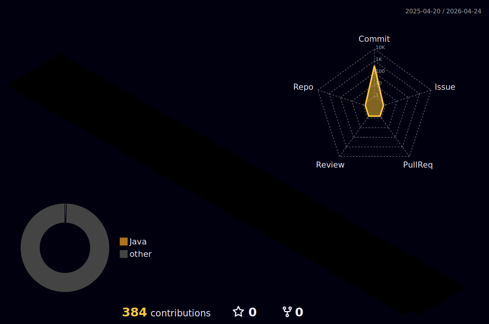

<!-- Header -->

  

<!-- subHeading -->
>우여곡절 가득한 제 hub에 오신걸 환영합니다!
>'BIT'는 'Best In Town' 일상에서 뛰어난 것에 대한 표현으로 어디서든 뛰어난 사람이 되고자 노력하는 제 삶의 가치를 의미합니다. 또 다른 의미로는 저의 이름인 Bora의 'B'와 'Git'을 결합한 언어유희로 탄생한 'Bit Hub' 입니다 :)

<!-- Stack -->
 

  <h2 align="center">
    STACK
  </h2>

  

  
 | 분류                     | 기술 스택                                                                      |
 | ---------------------- | ------------------------------------------------------------------------- |
 | **Language**           | Java, JavaScript, HTML5, CSS3                                             |
 | **Frontend**           | Vue.js, Vuex, React Native, Axios, Chart.js                               |
 | **Backend**            | Spring Boot, Spring Security, Spring Data JPA, JWT, OAuth 2.0, Swagger    |
 | **Database**           | MySQL, MariaDB, Redis                                                     |
 | **Infra & CI/CD**      | AWS (EC2, S3, RDS, Route 53), GitHub Actions, Jenkins, Docker, Kubernetes |
 | **API & 라이브러리**        | OpenAI API, OpenWeatherMap API, Gradle, Hibernate, Apache POI             |
 | **Monitoring & Tools** | Grafana, Prometheus, Postman, Figma, Microsoft Excel                      |
 | **Production & ETC**   | Apache Tomcat, NPM, SSL, Ubuntu, Google Cloud                             |
   
  

<!-- Project -->
   
 <h2 align="center">
     My Project
   </h2>   
<h4 align="right">
 Click this images!👇&nbsp;&nbsp;&nbsp;&nbsp;&nbsp;&nbsp;&nbsp;&nbsp;&nbsp;&nbsp;&nbsp;&nbsp;&nbsp;&nbsp;&nbsp;&nbsp;
</h4>

  <!-- 1st WLOP -->
  

  <!-- 2nd InnerJoinUs -->
  

  <!-- 3rd MoodHolic -->
  

  <!-- fin Pioms -->
  

<!-- USe Record -->
 
<h2 align="center">
     Use&Commit Record
</h2>

  <!-- 왼쪽: 언어 통계 -->
  

  <!-- 오른쪽: 커밋 3D 그래프 -->
  

<!-- 

-->
